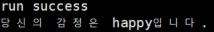

# 표정 인식
angry, disgusted, fearful, happy, sad, suprised, neutral 총 7개의 표정을 인식 
Facial Expression Recognition(FER) 2013에서 우수한 정확도를 기록한 모델 
Tensorflow 기반으로 짜여진 CNN네트워크를 사용
 

필요한 라이브러리 버전
-
- Python (>= 3.3)
- Tensorflow (>= 1.1.0)
- OpenCV (python3-version)

사용한 라이브러리 버전
-
- Python 3.5.2
- rknn에서 요구하는 라이브러리 그대로 사용

파일 설명
-
- convert : rknn으로 바꾸기 위해 필요한 ckpt, pbtxt, frozen pb 파일
- data : haarcascade_files는 얼굴 인식, image는 예제 이미지

코드 실행
-
	python demo.py

 

인용
-
https://github.com/xionghc/Facial-Expression-Recognition
